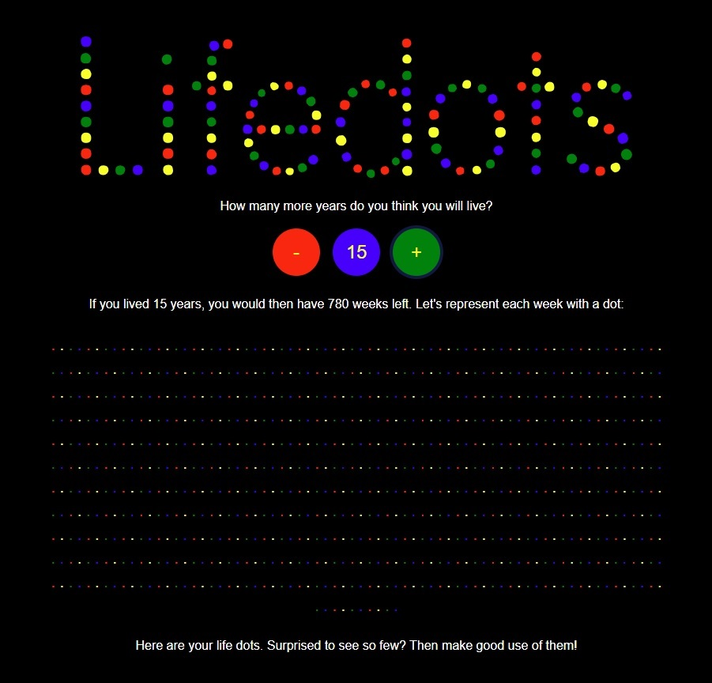

# LifeDots Blazor Application



## Overview

The **LifeDots** project is a Blazor application designed to visualize the remaining weeks of a user's estimated lifespan as colored dots. This application is built using Blazor, .NET, and follows best practices such as SOLID principles and clean code methodologies.

## Features

- **User-Friendly Interface**: The application provides a simple and intuitive interface to calculate and visualize remaining life weeks.
- **Customizable Components**: Built with reusable Blazor components to ensure maintainability and scalability.
- **SOLID Principles**: Adheres to SOLID principles to ensure the code is modular, extensible, and easy to maintain.

## Project Structure

The project is structured into several key components:

### Interfaces
- **ICounterHandler.cs**: Interface for handling counter logic.
- **IDotColorizer.cs**: Interface for managing the logic of coloring dots based on user data.
- **IDotGenerator.cs**: Interface responsible for generating the dot visualization.
- **IHomeService.cs**: Interface for managing home page services.
- **IMessageService.cs**: Interface for handling message services within the application.

### Pages
- **Home.razor**: The main page of the application, where the dot visualization is rendered.
- **Home.razor.cs**: Code-behind for `Home.razor` handling logic and interactions.

### Services
- **CounterHandler.cs**: Implementation of the `ICounterHandler` interface, managing the counting logic.
- **DotColorizer.cs**: Implementation of the `IDotColorizer` interface, providing the logic for coloring dots.
- **DotGenerator.cs**: Implementation of the `IDotGenerator` interface, responsible for generating the dots based on user input.
- **HomeService.cs**: Implementation of the `IHomeService` interface, managing services related to the home page.
- **MessageService.cs**: Implementation of the `IMessageService` interface, providing messaging capabilities within the app.

### Main Program
- **Program.cs**: The entry point of the application, configuring services and the app's request pipeline.

## Setup and Deployment

### Prerequisites

- [.NET SDK](https://dotnet.microsoft.com/download)
- [Visual Studio](https://visualstudio.microsoft.com/) or [Visual Studio Code](https://code.visualstudio.com/)

### Running Locally

1. Clone the repository:
   ```bash
   git clone <repository-url>
   cd LifeDots
   ```

2. Build the project:
   ```bash
   dotnet build
   ```

3. Run the application:
   ```bash
   dotnet run
   ```

4. Open your browser and navigate to `https://localhost:5001` to view the application.

### Deployment

The application can be deployed to platforms like GitHub Pages or Azure. Follow the appropriate platform's documentation for deploying Blazor applications.

## Contributing

Contributions are welcome! Please fork the repository and submit a pull request for any enhancements or bug fixes.

## License

This project is licensed under the MIT License - see the [LICENSE](LICENSE) file for details.

## Acknowledgements

- Thanks to the Blazor and .NET communities for their support and resources.
